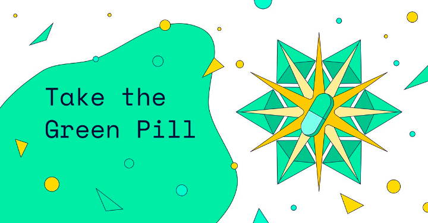

# Focus

The science is clear. To keep 1.5 alive we need reductions, resilience and removals. The delivery of a resilient, zero carbon world in time to ensure a safe climate means reducing our CO2 emissions by at least 50% or more by 2030, reaching net zero emissions by 2050 and staying at net-negative emissions throughout the second half of the century.

Carbon removal provides a unique opportunity to provide green jobs and skills, increase financial flow to emerging economies, positively impact biodiversity, tackle food security and many others. Today, we are removing far less than a gigaton per year.  To scale this action up, capital investment in CDR should reach $100 Billion per year by 2030 (up from an estimated $10 billion today).&#x20;

CDR refers to any human-led efforts to remove CO2 from the atmosphere (not a point source, such as an exhaust, smokestack or flue-stack or natural sinks, such as pre-existing ecosystems).


The NFT market has grown inexorably, with trade volumes jumping from $74 million at the start of 2021 to $25 billion by the end of the year. Since then, growth has only escalated, with NFT trading volumes reaching $12 billion in the first quarter of 2022 alone.


The proof-of-work approach demands the same amount of electricity as an ordinary American home over nearly nine days to mint a single NFT. When the same NFT is acquired and sold, the same amount of energy is expended.&#x20;

In other words, one NFT transaction on Ethereum consumes the same amount of energy as about 331,056 Visa transactions or 24,895 hours of YouTube viewing

<figure><figcaption>
Im KlimaDAO
</figcaption></figure>

According to the World Economic Forum's Global Risks Report (2020), nature loss threatens to disrupt more than half of the world's GDP ($44 trillion). Because of the enormous value that natural capital provides, all industries, from fishing and agriculture to building and pharmaceuticals, have a strong interest in safeguarding it. Nature-friendly business strategies, on the other hand, have the potential to generate $10 trillion in yearly revenue and 395 million jobs by 2030.

Furthermore, businesses do not exist apart from the communities in which they operate, all of which rely on a healthy environment for existence and well-being. Regardless matter how organizations look at it, the cost of ignoring these repercussions is simply too high.

### From habitable worlds to hot Jupiters, the Planetary Metaverse Simulator has it all.

PlanetSWH aspires to be a groundbreaking virtual experience in which users can create then interact with known discovered planets as a metaverse in which they can unleash their creativity.

Using blockchain scalability, deep learning, and AI to learn more about these super-earths and see if they can support life while having fun and saving our planet from catastrophic climate change.&#x20;


Youtube: PlanetSWH


#### Aid with the planting of trees in deforested areas.&#x20;

Restore healthy forest systems in order to protect animal habitat and endangered species.&#x20;

Create jobs for the folks that live in these impoverished countries.&#x20;

Purify drinking water sources.

Reduce flooding and erosion.&#x20;

Contribute to the replenishment of soil nutrients required for agricultural.

Enhance air quality.

Help to maintain a healthy food chain.

Reduce contamination of the land, air, and groundwater.

Save our priceless wildlife.&#x20;

Stop climate change and more.&#x20;

<figure><figcaption></figcaption></figure>

