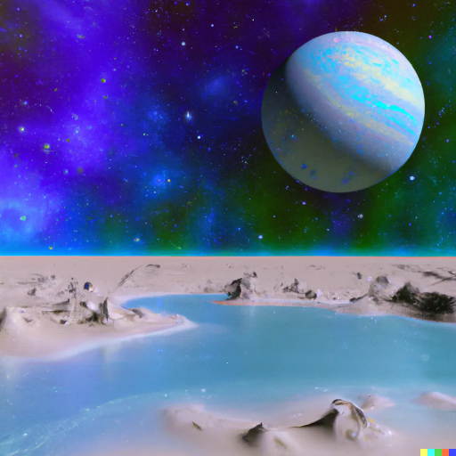
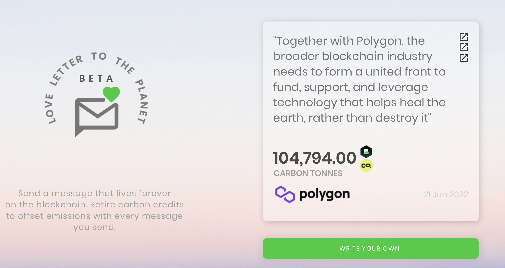

# Vision

Warning, this isn't complete, edited, or well-sourced. I may not finish this as it was mostly a personal exercise.

### From habitable worlds to hot Jupiters, the Planetary Metaverse Simulator has it all.

PlanetSWH aspires to be a groundbreaking virtual experience in which users can create then interact with known discovered planets as a metaverse in which they can unleash their creativity.

Outside our solar system, nearly 4% of habitable exoplanets between one and two times the size of Earth have been identified.

Using blockchain scalability, deep learning, and AI to learn more about these super-earths and see if they can support life while having fun.

<figure><figcaption>
Water – a key ingredient for life beyond Earth
</figcaption></figure>

#### Water – a key ingredient for life beyond Earth

ExTrA will look for transiting planets around cool stars in the hopes of detecting Earth-sized planets in their habitable zone. In this region around a star, a planet can have surface temperatures consistent with the presence of liquid water.

#### ExoLights developed an open-source infrastructure for observing, analyzing, and interpreting exoplanet atmospheres.

The prime factor determining the planet temperature is its distance from the host star hypothetically for our project this may differ as we develop further.

One theory is that super-Earth cores will be divided into iron- and nickel-rich portions. "This is an entirely new concept that needs to be thoroughly investigated," he adds. Researchers are collaborating with modelers to incorporate the outcomes of the calculations into their models.&#x20;

### They will be able to determine the critical parameters in describing these exoplanets and determining the right circumstances for habitability as a result.&#x20;

Big Data assists in the resolution of several extraterrestrial puzzles. There is no resemblance between the 4,000 exoplanets identified so far in the Milky Way and those orbiting the sun. An EU initiative investigated the features of exoplanets and what differentiates them.&#x20;

<figure><figcaption></figcaption></figure>

#### Together with Polygon, the blockchain industry as a whole must band together to fund, support, and use technology that helps heal the planet rather than damage it.

<figure><figcaption>
Credit: KlimaDAO
</figcaption></figure>

Send a love letter and retire carbon offsets every time. This is your chance to support environmental programs.

Write your love letter in no more than 280 characters. Enter your message and dedicate your retirement to reducing your personal carbon footprint or that of a loved one. There is a character limit of 280.&#x20;

Send a message that will live forever on the blockchain. Retire carbon credits to offset emissions with each message you send.

People and businesses all over the world are sending love letters to one another. Join the fight for our planet's future.
