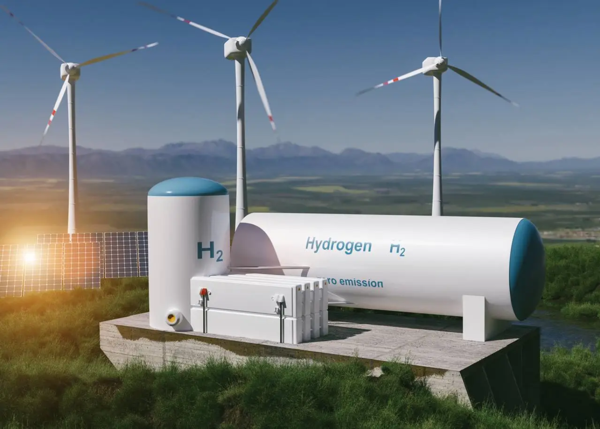

# 🌍 Carbon Positive Africa

BY JACK KIMANI, FOUNDING CEO OF THE CLIMATE ACTION PLATFORM FOR AFRICA (CAP-A) | NOVEMBER 7, 2022

Africa carries the heaviest burden of climate change effects despite contributing [less than 4%](https://www.weforum.org/agenda/2022/11/africa-business-climate-change-mitigation-adaptation/) of the GHG emissions. However, limiting Africa’s role in the climate dialogue to just [Loss, Damage](https://climatechampions.unfccc.int/climate-champions-define-plan-to-galvanize-action-on-losses-and-damages/), Adaptation and Resilience, does a huge disservice to the continent’s potential to play a crucial role in the planet’s climate future. It ignores Africa’s potential in making an important contribution to tackling climate change globally by leading the world in limiting emissions, driving climate restoration and orienting Africa towards its strengths which translate into major new segments of economic opportunity.

[Africa holds the key](https://climatechampions.unfccc.int/can-africa-be-a-continent-of-solutions-to-the-climate-crisis/) to accelerating global climate action. The continent doesn’t have an “old economy” that needs to be decarbonized. It can invest right away in the green economy that we need — an economy that’s net positive for the planet and the people. Importantly, if African countries were to grow to middle income status with a similar emission per capita as current middle income countries, we can forget about keeping peak warming below 1.5 degrees.

<figure><figcaption>
Image Pixabay
</figcaption></figure>

Africa is blessed with a young and growing workforce, huge endowments of land and various natural resources, and tremendous amounts of untapped renewable energy potential. If properly deployed, these assets could be crucial in driving global mitigation efforts, while creating new economic opportunities for the continent. At the [Climate Action Platform for Africa (CAP-A)](https://capa.earthrise.media/), we see three distinct pathways that Africa can pursue, by leveraging these assets, to combat climate change:

Africa can follow a low/free emissions growth path by leapfrogging directly to green pathways without legacy energy and agricultural assets, employing the latest sustainable technologies and business models for consumption and production. Some may view this as a prohibition against allowing Africa to use fossil fuels for its growth. However, research has shown that sustainable technologies may offer more attractive benefits including job creation, better public health and improved climate change resilience for the continent than other alternatives.

We need to invest in a [Just Energy Transition for Africa](https://climatechampions.unfccc.int/powering-africas-green-growth-beyond-adaptation-and-resilience/) that is not just about moving from emitting to clean sources but is also about the urgent need to provide access to modern energy for all those who currently lack it. Global investments to develop Africa’s tremendous renewable energy potential could allow us to reach our energy access and economic growth ambitions, while also avoiding massive future stranded assets. We can extend this thinking beyond just power generation, to include other major emitting sectors such as transportation and construction, where Africa’s share of global activity is growing rapidly, and where sustainable new technologies could quickly scale up in the absence of older and dirtier technologies.

<figure><figcaption>
In the Fulani village of Hore Mondji, located in southern Mauritania on the banks of the Senegal River, a women’s cooperative uses solar energy to operate the borehole that supplies water to the market garden. Africa can follow a low/free emissions growth path by leapfrogging directly to green pathways without legacy energy and agricultural assets, employing the latest sustainable technologies and business models for consumption and production.
</figcaption></figure>

African economies still find themselves largely limited to raw material exports, with very little value addition happening on the continent. This is one of the root causes of the struggle to generate jobs and opportunities for our growing youth bulge. It also contributes substantially to climate change, since many of our bulky raw exports are shipped long distances to be processed using energy from coal and other polluting sources. Simply moving more industrial processing investments onto the continent substantially reduces emissions from global value chains, while creating much needed employment and economic diversification.&#x20;

Africa can serve growing demand for low-footprint products and services, onshoring the production of goods and services that the continent needs as it grows its economy in addition to producing for the world. New energy-hungry products such as[ green hydrogen](https://climatechampions.unfccc.int/africa-green-hydrogen-alliance/) that will be key to the energy transition are an area where investment in African production capacity could significantly benefit the whole world. Indeed, if we fully exploit Africa’s combination of renewable energy potential, raw materials and labour, it should be a competitive location for a wide range of manufacturing activities that the world urgently needs to decarbonize.

<figure><figcaption>
New energy-hungry products such as green hydrogen that will be key to the energy transition are an area where investment in African production capacity could significantly benefit the whole world.
</figcaption></figure>

Scientists now agree that in addition to reducing global emissions as fast as we can, we will also need to remove substantial amounts of carbon dioxide from the atmosphere, to make up for hard to decarbonize sectors and the consequences of slow action to curb emissions. Africa’s substantial remaining forests, grasslands, peatlands and mangroves already play a critical role in slowing climate change and environmental degradation. But despite their value as key lungs for the world, virtually no compensation is given to the communities that have protected them. We urgently need to strengthen and deepen carbon markets and other mechanisms for recognizing Africa’s natural wealth and compensating those who already are working to not only protect but grow it. Solutions such as biochar among others which could increase the amount of carbon stored in African soils would not only address our shared climate crisis, but also create the much needed jobs that are the continent’s biggest priority if adopted on a massive scale.&#x20;

Africa could also deploy some of her unused renewable energy, and resources such as abundant geological carbon storage to actually start scaling up new technologies for carbon removal where they can actually be most effective.

<figure><figcaption>
Africa’s substantial remaining forests, grasslands, peatlands and mangroves already play a critical role in slowing climate change and environmental degradation. Image: Unsplash
</figcaption></figure>

Africa’s substantial remaining forests, grasslands, peatlands and mangroves already play a critical role in slowing climate change and environmental degradation. Image: Unsplash

Each of these types of solutions require private sector scales of capital but offer huge substantial climate benefits while also feeding economic growth. In many cases the business case for investment already offers the potential for meaningful returns, if we work together to address structural barriers.

However, they are going unrecognized and untapped because we are not willing to look beyond the idea of Africa as merely a victim of climate change.&#x20;

To change this, we need to start by seizing the most immediate opportunities that already exist. Capital owners in the global north also need to get over their home country biases that cause them to allocate capital often too close to where they live.

**Follow Jack Kimani on** [**Twitter**](https://twitter.com/ClimateActAfric) **&** [**LinkedIn**](https://www.linkedin.com/company/climate-action-platform-for-africa-cap-a/)

<figure><figcaption>
<a href="https://climatechampions.unfccc.int/africas-role-in-decarbonizing-the-planet/">https://climatechampions.unfccc.int/africas-role-in-decarbonizing-the-planet/</a>
</figcaption></figure>

