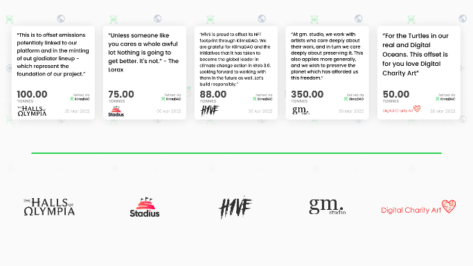

# 🖼 NFT Marketplace & Collection

The Genesis collection will consist of 1,000 AI pieces, including 250 videos, of a unique collaboration between space research and artificial intelligence, bridging the gap between astronomy, natural and the supernatural sciences.

#### Are NFTs bad for the environment?

The proof-of-work approach demands the same amount of electricity as an ordinary American home over nearly nine days to mint a single NFT. When the same NFT is acquired and sold, the same amount of energy is expended.&#x20;

In other words, one NFT transaction on Ethereum consumes the same amount of energy as about 331,056 Visa transactions or 24,895 hours of YouTube viewing.

<figure><figcaption></figcaption></figure>

#### A smart contract-signed commitment

Embedding staked KLIMA within the smart contract is a strong and poetic technique to improve the NFT collection atmosphere.

Below you can see the carbon footprint of top NFT projects and why we aim towards an eco friendly NFT Collection and Marketplace.

<figure><figcaption>
Credit KlimDAO
</figcaption></figure>

Digital Charity Art, based in New Zealand, collaborated with KlimaDAO on their most recent series of NFTs, which operate as a time capsule, storing and accumulating carbon offsets over time while creating financial flow for ocean conservation. When an NFT was minted, the buyer could burn it to obtain the underlying KLIMA as well as 70% of the staking rewards.&#x20;

The remaining 30% of incentives are claimed by DCA and directed to ocean conservation nonprofits over the course of the year (World for Wildlife NZ, Sea Shepherd NZ, See Turtles, Marine Megafauna Foundation, and Oceanic Society). Aid with the planting of trees in deforested areas. Restore healthy forest systems in order to protect animal habitat and endangered species.&#x20;

#### Create jobs for the folks that live in these impoverished countries.&#x20;

#### Recent Use Cases

<figure><figcaption>
Credit KlimaDAO
</figcaption></figure>

With 100 tonnes retired, Halls of Olympia, an immersive blockchain sporting arena, neutralized three times their NFT mint emissions.&#x20;

Stadius, a platform that links businesses with their followers through one-of-a-kind NFTs, began their environmental commitment by retiring 75 kilograms.&#x20;

H1VE collectively neutralized 88 tonnes of CO2, nearly one-third of their expected launch footprint.&#x20;

They promise to offset the remaining in the future to maintain carbon neutrality. Gm.studio is an NFT artist collaborative.&#x20;

They published their love letter to the world, which resulted in the release of 350 tonnes of CO2 – more than five times their carbon impact.

