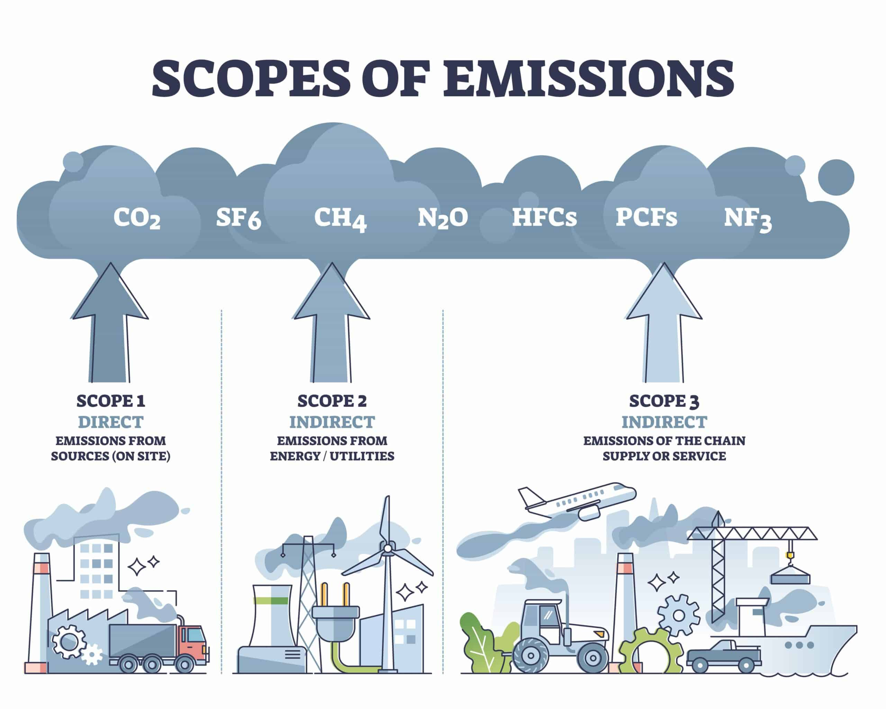

# 🌳 A,B,C’s of Carbon Emissions

### What Exactly Are The Scopes? 

🔭Scopes 1, 2, and 3 are classifications of corporate greenhouse gas (GHG) emissions outlined in an international climate agreement called the GHG Protocol.

The scopes represent different emissions categories based on **how directly they relate to the company measuring them.**

### Scope 1 

1️⃣Scope 1 emissions are the most direct form of emission that a company can produce.&#x20;

They occur when something the company owns or uses requires emitting greenhouse gases to operate.

The use of gas-powered company vehicles is a typical Scope 1 emission. Other common types include fugitive emissions from leaks in refrigeration or air conditioning and process emissions from factories and manufacturing.

Essentially, any greenhouse gas emission directly resulting from an action the company takes is classified as Scope 1.

### Scope 2 

2️⃣Scope 2 emissions are one layer removed from the direct way Scope 1 emissions are calculated.&#x20;

Essentially, any company action that requires power usage is calculated as a Scope 2 emission.

Common Scope 2 emissions are actions like the use of office electricity and company electric vehicles.

Not included in Scope 2 emissions are the purchase of energy from companies that work with the measuring company, such as the purchase of electricity to power an electric vehicle that is delivering goods to the measuring company.

### Scope 3 

3️⃣Scope 3 emissions are more complex. They fall into two categories: upstream and downstream.

**Upstream**

Upstream emissions occur due to a company action or purchase used to sell their product.

Common operations included in upstream Scope 3 emissions are business travel, employee commuting, waste generated from operations, and the use of capital goods, which include the emissions required to build the office a company uses.

Also included in upstream emissions are transportation and distribution emissions, but they can also be downstream emissions depending on where they occur in the product life cycle.

**Downstream**

Downstream Scope 3 emissions occur after the product has been sold.

Commonly, these include emissions that stem from the product's end use, like the electricity required to power a lightbulb that a company sold, the processing of sold products, and the emissions needed to get rid of the products once they reach their end life.

Additionally, downstream Scope 3 emissions include emissions that come from what the company uses the money it receives selling its product for, such as leased assets, investments, and the operations of franchises.

Due to the wide range of activities in Scope 3 emissions, most corporate emissions are classified as Scope 3.

<figure><figcaption>
Image ESG Pro <a href="https://esgpro.co.uk/what-are-carbon-reporting-scopes/">https://esgpro.co.uk/</a>
</figcaption></figure>

### Why Is The Scope System Important? 

Carbon offsetting is one of the best ways to fight the climate crisis, but the theory behind it relies on the assumption that companies actually know how many emissions they create.

The scope system, especially Scope 3, allows companies to know that number by accounting for every possible way a company’s operations affect the environment.Thus, the scope system allows carbon offsetting to work as a climate solution, which is integral to the larger fight against the climate crisis.
